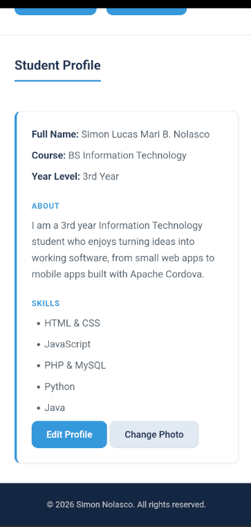
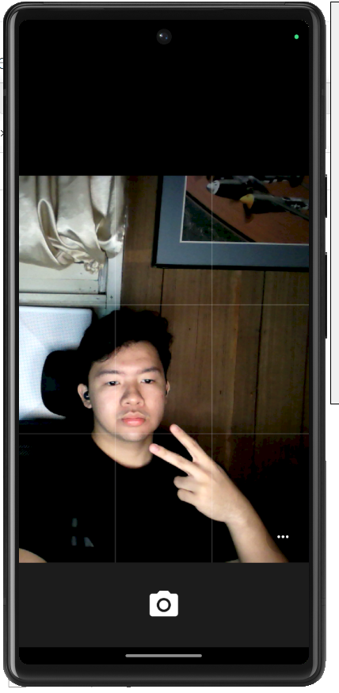
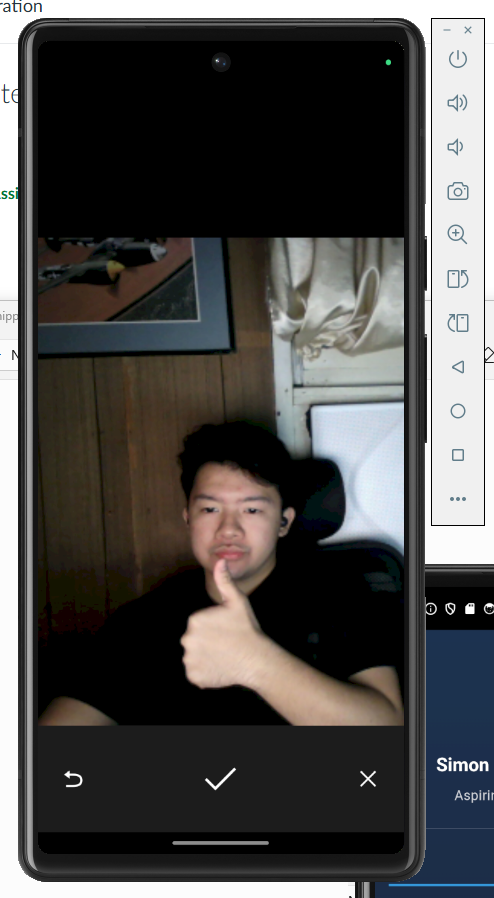

# Nolasco_StudentProfile

ITCC 41 - Mobile Application Development
Activity 6: Camera Integration

## 1. Project Description

A multi-page student profile app made with HTML, CSS, and JavaScript,
compiled with Apache Cordova. Built on top of Activity 5, adding the ability
to change the profile picture using the device camera.

## 2. Application Pages

- Profile - homepage, short introduction, editable Student Profile card, Change Photo button, links to the other pages
- About - detailed personal introduction, interests, educational background, goals
- Skills - five skills with short descriptions
- Projects - three projects with title, description, role, and tools used
- Contact - email, GitHub, and Facebook

## 3. Profile Editing

The Profile page has a Student Profile card showing Full Name, Course, Year
Level, About, and Skills, with an Edit Profile button. Clicking it opens a
form pre-filled with the current values. Saving checks that Full Name,
Course, Year Level, and About Me are not blank, then updates the card and
saves the data to localStorage. Canceling closes the form without changing
anything. Closing and reopening the app keeps the last saved information.

## 4. Camera Integration

The Profile page has a Change Photo button next to Edit Profile. Tapping it
calls the Cordova camera plugin (cordova-plugin-camera), which opens the
device camera. After taking a photo, the image is returned to the app and
set as the profile picture right away. Tapping Change Photo again replaces
the picture with a new one.

## 5. Device Feature Integration

Cordova is used because a regular web page cannot access a phone's camera
hardware directly. The cordova-plugin-camera plugin bridges JavaScript to
the native camera through an Android intent. The device's own Camera app
handles opening the camera and taking the photo, then hands the resulting
image back to the app's JavaScript through a callback function.

## 6. Image Handling

The captured photo is returned as a base64 image string, turned into a data
URL, and set directly as the profile picture's image source. It is also
saved to localStorage under its own key, separate from the rest of the
profile data. When any page loads, a small script checks localStorage for a
saved photo and displays it instead of the default picture if one exists.
This is how the picture stays the same after closing and reopening the app.

## 7. Error Handling

If the user opens the camera and backs out without taking a photo, the app
does nothing and the existing profile picture stays as it is. If the camera
plugin reports an actual error, such as permission being denied, the app
shows the message "Unable to access the camera. Please check your device
permissions." instead of crashing.

## 8. Responsive Design

All 5 pages use the same stylesheet, so the same responsive behavior from
earlier activities applies everywhere, including the Change Photo button.
Mobile first CSS with two media queries at 600px and 1024px.

## 9. How to Run

```
cordova platform add android@13
cordova plugin add cordova-plugin-camera
cordova build android
cordova run android --emulator
```

## 10. Application Screenshots

### Student Profile


### Change Profile Picture


### Camera


### Captured Image


### Updated Profile Picture

