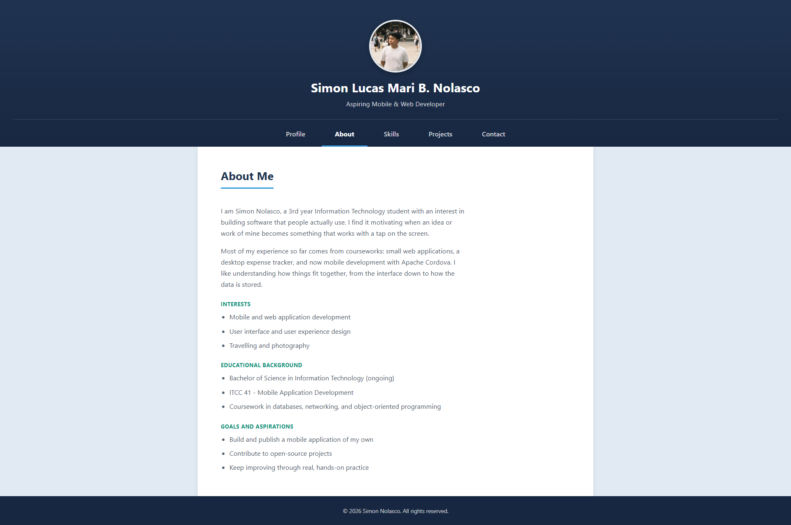
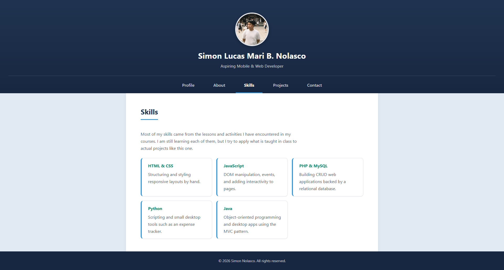

# Nolasco_StudentProfile

ITCC 41 - Mobile Application Development, Activity 2.
A **Basic Student Profile** built with HTML, CSS and JavaScript, then bundled
and compiled with Apache Cordova and run on an Android emulator.

## Contents

The profile is a single screen made up of four parts:

- **Header** - profile picture, complete name, an "About Myself" subtitle, and the navigation menu
- **Navigation menu** - About and Skills
- **About section** - two paragraphs, plus interests, educational background, and goals
- **Skills section** - a short description and seven skills
- **Footer** - copyright notice, name, and the current year

## The interaction

Tapping **About** or **Skills** in the navigation menu switches between the two
sections without reloading the page. The tapped button stays highlighted and the
incoming section fades in.

This is done with plain JavaScript using events and the DOM: a `click` listener
on each button reads its `data-target`, then adds or removes the `is-visible`
class on the matching section. The footer year is also filled in automatically
with `new Date().getFullYear()`.

## Project structure

```
www/
  index.html      structure of the profile
  css/index.css   all styling (colours, layout, animation)
  js/index.js     the navigation interaction and footer year
  img/profile.svg placeholder profile picture
```

## Setup

- Node.js v24.7.0
- Cordova CLI 13.0.0
- cordova-android 13.0.0
- Android Studio (JDK 17, Android SDK API 34, Build-Tools 34.0.0)
- Gradle 8.7

## Commands used

```
cordova create Nolasco_StudentProfile com.example.nolascostudentprofile Nolasco_StudentProfile
cordova platform add android@13
cordova build android
cordova run android --emulator
```

## Screenshots

### About section


### Skills section


### Build successful

