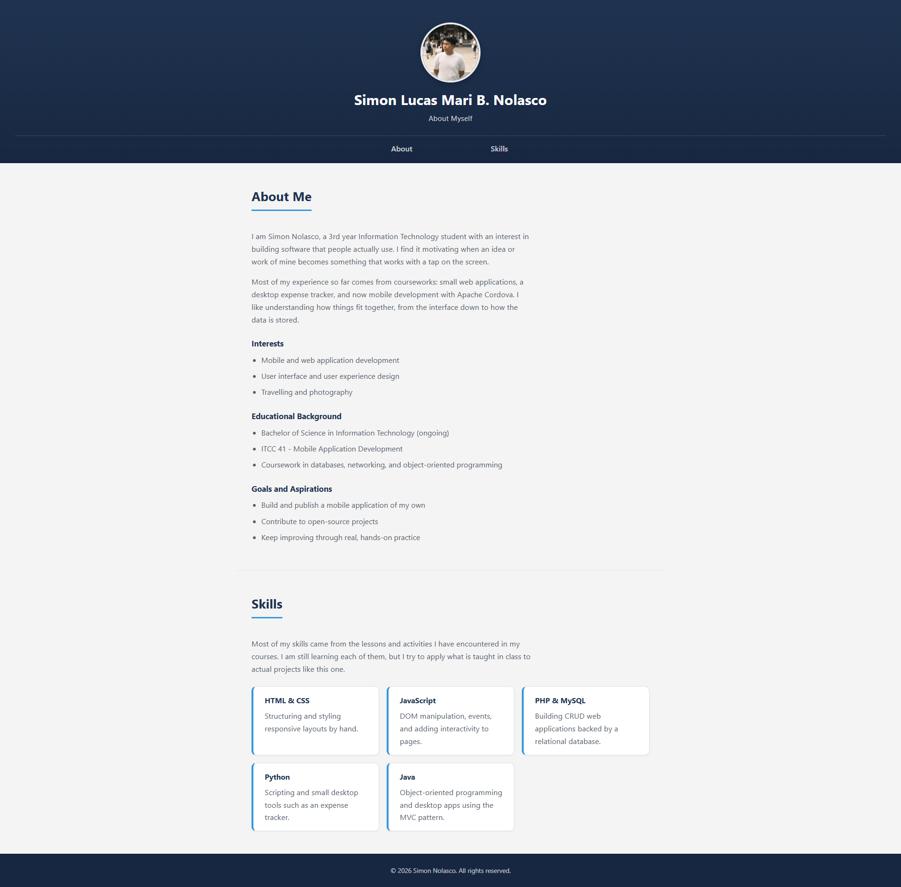
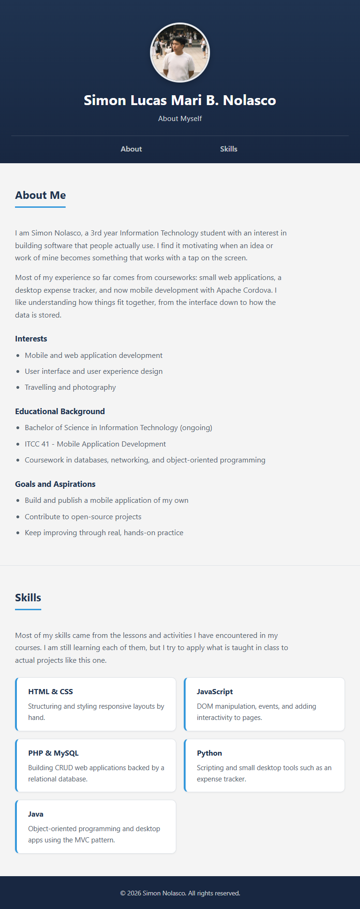
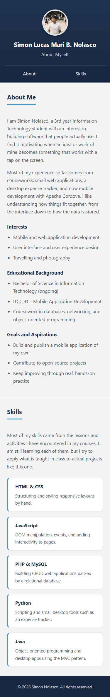

# Nolasco_StudentProfile

ITCC 41 - Mobile Application Development
Activity 3: Responsive Student Profile

## 1. Project Description

A student profile app made with HTML and CSS, compiled with Apache Cordova.
It shows my photo, name, About section, and Skills section, and now works
properly on Desktop, Tablet, and Mobile screens.

## 2. Application Structure

- Header - profile picture, name, "About Myself" subtitle, navigation menu
- Navigation Menu - About and Skills links
- About Section - two paragraphs about myself, interests, educational
  background, goals
- Skills Section - five skills with short descriptions
- Footer - copyright notice, name, current year

## 3. Responsive Design

Built mobile-first: the base CSS is written for the smallest screen, then two
media queries at 600px and 1024px adjust the layout for tablet and desktop.
Headings use `clamp()` so text size scales with the screen instead of jumping
at each breakpoint. The Skills section uses CSS Grid, going from 1 column on
mobile, to 2 on tablet, to 3 on desktop.

## 4. UI/UX Principles Applied

- **Responsive Layout** - layout adapts to Desktop, Tablet, and Mobile with
  no horizontal scrolling.
- **Mobile-Friendly Spacing** - consistent spacing used throughout.
- **Appropriate Typography** - readable text sizes on every screen.
- **Clear Visual Hierarchy** - name, headings, and subheadings are visually
  distinct.
- **Usable Controls** - nav links are easy to tap, with hover/focus states.
- **Basic Accessibility** - skip link, alt text, labeled sections, visible
  focus outlines.
- **Consistent Design** - same colors and spacing used in every section.

## 5. Navigation

The About and Skills links are anchor links (`href="#about"`, `href="#skills"`)
that scroll to their section on the same page. No JavaScript is used for
navigation or for the responsive layout.

## 6. How to Run

cordova platform add android@13
cordova build android
cordova run android --emulator

## 7. Application Screenshots

### Desktop

### Tablet

### Mobile
