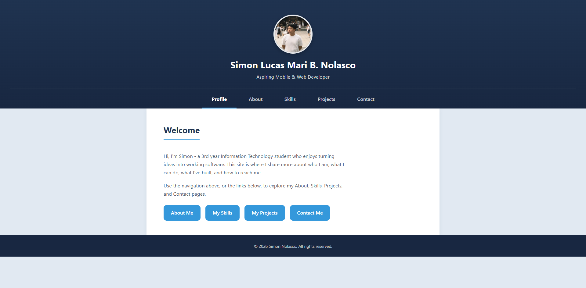
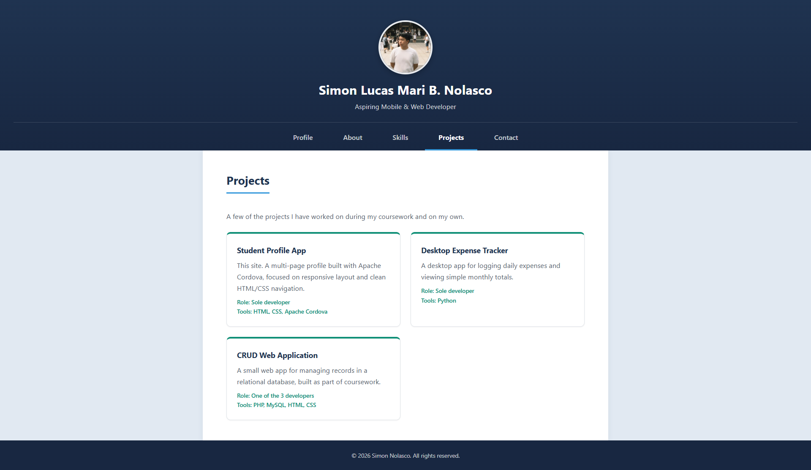
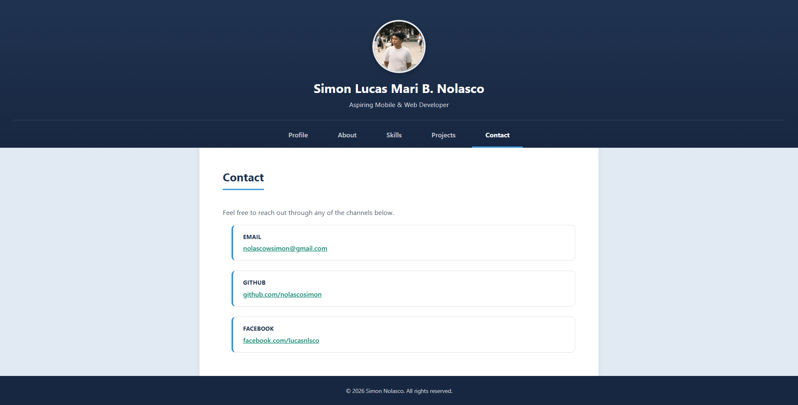

# Nolasco_StudentProfile

ITCC 41 - Mobile Application Development
Activity 4: Multi-Page Student Profile

## 1. Project Description

A multi-page student profile app made with HTML and CSS, compiled with Apache
Cordova. Expanded from Activity 3 into 5 separate pages, each with its own
purpose, while keeping the same responsive design.

## 2. Application Pages

- Profile - homepage, short introduction and tagline, links to the other pages
- About - detailed personal introduction, interests, educational background, goals
- Skills - five skills with short descriptions
- Projects - three projects with title, description, role, and tools used
- Contact - email, GitHub, and Facebook

## 3. Navigation

Every page has the same navigation menu with links to all 5 pages. The links
are plain HTML anchor tags pointing to the actual page files, for example
`href="about.html"`. No JavaScript is used for navigation. The current page is
shown bolded and underlined in the menu using a CSS attribute selector, not
JavaScript.

## 4. Responsive Design

All 5 pages use the same stylesheet, so the same responsive behavior from
Activity 3 applies everywhere. Mobile-first CSS with two media queries at
600px and 1024px. The navigation stacks vertically on mobile and becomes a
horizontal row on tablet and desktop. The Skills and Projects sections use CSS
Grid, going from 1 column on mobile up to 2 or 3 columns on larger screens.

## 5. UI/UX Principles Applied

- Consistency - same header, footer, navigation, colors, and spacing on every page
- Visual Hierarchy - name, headings, and subheadings are visually distinct on every page
- Usability - the current page is highlighted in the nav so users know where they are
- Readability - readable text sizes on every screen size
- Accessibility - skip link, alt text, labeled sections, visible focus outlines

## 6. How to Run

```
cordova platform add android@13
cordova build android
cordova run android --emulator
```

## 7. Application Screenshots

### Profile


### About


### Skills


### Projects


### Contact

