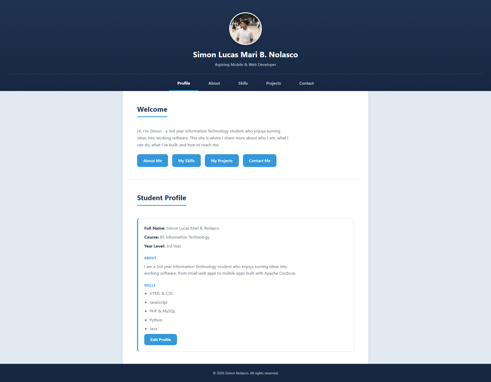
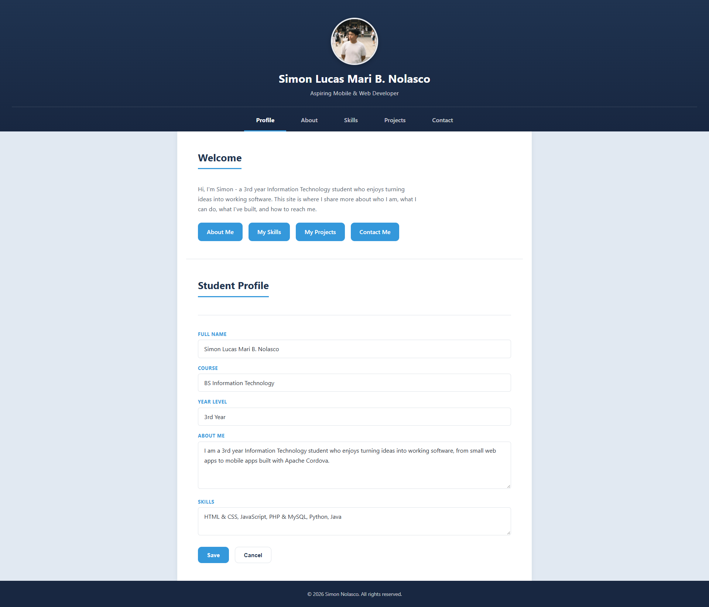
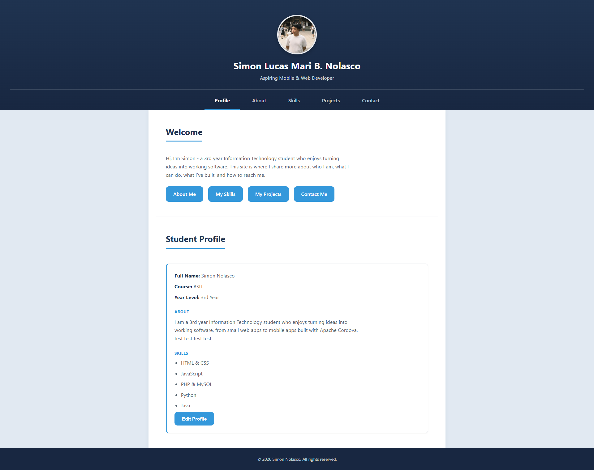

# Nolasco_StudentProfile

ITCC 41 - Mobile Application Development
Activity 5: Student Profile Editing & Local Data Storage

## 1. Project Description

A multi-page student profile app made with HTML, CSS, and JavaScript,
compiled with Apache Cordova. Built on top of Activity 4, adding an Edit
Profile feature that lets the student update their information and have it
saved on the device using localStorage.

## 2. Application Pages

- Profile - homepage, short introduction, editable Student Profile card, links to the other pages
- About - detailed personal introduction, interests, educational background, goals
- Skills - five skills with short descriptions
- Projects - three projects with title, description, role, and tools used
- Contact - email, GitHub, and Facebook

## 3. Profile Editing

The Profile page has a Student Profile card showing Full Name, Course, Year
Level, About, and Skills, with an Edit Profile button. Clicking it opens a
form with the same fields pre-filled with the current values. Saving updates
the card immediately. Canceling closes the form and leaves the card
unchanged.

## 4. JavaScript Functionality

JavaScript in js/profile.js handles the Edit Profile feature:

- Reads the values typed into the form when Save is clicked
- Checks that Full Name, Course, Year Level, and About Me are not empty
  before allowing a save, and shows an error message if any are blank
- Updates the profile card on the page immediately after a valid save,
  without reloading the page
- Cancel discards whatever was typed and reopens the unchanged card

No JavaScript is used for page navigation, only for the Edit Profile feature.

## 5. Local Data Storage

Profile data is saved to the browser's localStorage as a single JSON object
whenever Save is clicked. When the page loads, the script checks localStorage
for saved data. If it finds some, it displays that instead of the defaults.
If nothing is saved yet, it displays default profile information. This means
edits are still there after closing and reopening the page.

## 6. Responsive Design

All 5 pages use the same stylesheet, so the same responsive behavior from
Activity 3 and 4 applies everywhere, including the Edit Profile form. Mobile
first CSS with two media queries at 600px and 1024px. The navigation stacks
vertically on mobile and becomes a horizontal row on tablet and desktop.

## 7. How to Run

```
cordova platform add android@13
cordova build android
cordova run android --emulator
```

## 8. Application Screenshots

### Student Profile


### Edit Profile


### Updated Profile


### Contact

